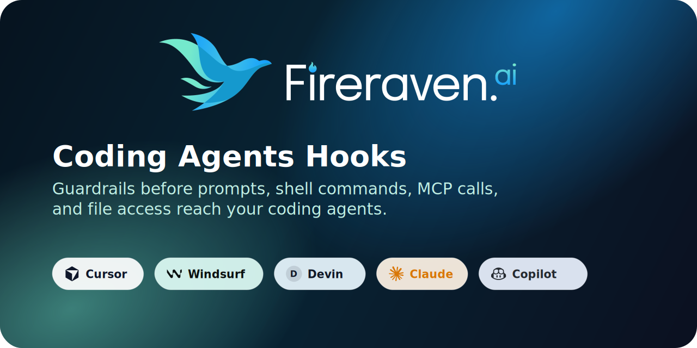
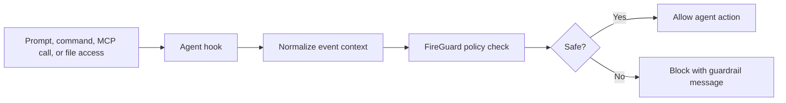

# Fireraven Agent Hooks

<p align="center">
  
</p>

<p align="center">
  <a href="LICENSE"></a>
  
  
  
  
</p>

FireGuard guardrails for AI coding agents: **Windsurf/Devin**, **Cursor**, **Claude Code**, and **Microsoft Copilot**.

Block secret leakage, dangerous execution, and data poisoning at the hook layer — before prompts, shell commands, MCP calls, and file writes reach your agent.



## Quick install for macOS, Linux, and WSL

```bash
curl -fsSL https://raw.githubusercontent.com/fireravenai/fireraven-agent-hooks/refs/heads/main/install.sh | sh
```

Install all supported local agents:

```bash
curl -fsSL https://raw.githubusercontent.com/fireravenai/fireraven-agent-hooks/refs/heads/main/install.sh | sh -s -- --agent all
```

Or use the CLI from a clone:

```bash
./fg install --agent windsurf
./fg init
./fg doctor
```

## Quick install for Windows

Run PowerShell as your normal Windows user. Install Python 3 first if `py -3 --version` or `python --version` does not work.

Install Devin/Windsurf hooks:

```powershell
irm https://raw.githubusercontent.com/fireravenai/fireraven-agent-hooks/refs/heads/main/install.ps1 | iex
```

Install Cursor hooks:

```powershell
& ([scriptblock]::Create((irm https://raw.githubusercontent.com/fireravenai/fireraven-agent-hooks/refs/heads/main/install.ps1))) -Agent cursor
```

Install all supported local agents:

```powershell
& ([scriptblock]::Create((irm https://raw.githubusercontent.com/fireravenai/fireraven-agent-hooks/refs/heads/main/install.ps1))) -Agent all
```

Or use the installer from a clone:

```powershell
powershell -ExecutionPolicy Bypass -File .\install.ps1 -Agent cursor
powershell -ExecutionPolicy Bypass -File .\install.ps1 -Agent windsurf
```

## Value proposition

| Threat | Coverage |
|--------|----------|
| Secret leakage | User prompts, file reads, MCP args, shell commands |
| Bad execution | `pre_run_command` / `beforeShellExecution` / tool gates |
| Data poisoning | `pre_write_code`, output audit on responses |

## Supported agents

| Agent | Install | Hook config | Blocking |
|-------|---------|-------------|----------|
| Windsurf / Devin | `--agent windsurf` or `-Agent windsurf` | `~/.codeium/windsurf/hooks.json` | pre-hooks (exit 2) |
| Cursor | `--agent cursor` or `-Agent cursor` | `~/.cursor/hooks.json` | JSON `continue: false` for prompts, `permission: deny` for other hooks |
| Claude Code | `--agent claude` | `~/.claude/settings.json` | PreToolUse (exit 2) |
| Copilot | See [adapters/copilot/README.md](adapters/copilot/README.md) | Studio connector topics | Flow conditions |

## Hook events by platform

### Windsurf / Devin

**Input (blocking):** `pre_user_prompt`, `pre_run_command`, `pre_mcp_tool_use`, `pre_write_code`, `pre_read_code`

**Output (audit only):** `post_cascade_response`, `post_write_code`

### Cursor

**Input (blocking):** `beforeSubmitPrompt`, `beforeShellExecution`, `beforeMCPExecution`, `beforeReadFile`

Denies via JSON rather than exit codes. `beforeSubmitPrompt` uses `{"continue": false}`; other Cursor events use `{"permission": "deny"}`.

### Claude Code

**Input (blocking):** `PreToolUse` (matcher `.*` — all tools)

Denies via exit code 2.

### Microsoft Copilot

No local shell hooks. FireGuard runs in **Copilot Studio** topic flows:

| Topic | Purpose |
|-------|---------|
| `topics/01_input_guardrail.yaml` | Input guardrails — block unsafe prompts |
| `topics/02_output_guardrail.yaml` | Output guardrails — audit/block assistant responses |

See [adapters/copilot/README.md](adapters/copilot/README.md) for connector setup.

## Windows setup details

### Cursor on Windows

The PowerShell installer writes:

| File | Purpose |
|------|---------|
| `%USERPROFILE%\.cursor\hooks.json` | Cursor hook registration |
| `%USERPROFILE%\.cursor\hooks\` | Fireraven hook scripts and config |
| `%USERPROFILE%\.cursor\hooks\config.env` | Fireraven credentials |

The installer registers Cursor hooks as `py -3 hooks/cursor_guardrail.py`, which Cursor runs from `%USERPROFILE%\.cursor`. This lets Cursor pipe hook JSON directly to Python without a PowerShell stdin bridge. After editing `config.env`, restart Cursor or reload the window, then check **View > Output > Hooks** if a hook does not appear to run.

If the Python launcher is not available in Cursor's hook environment, use the installed fallback wrapper in `%USERPROFILE%\.cursor\hooks.json`:

```json
{
  "command": "powershell -NoProfile -ExecutionPolicy Bypass -File hooks/run_cursor_guardrail.ps1"
}
```

### Devin/Windsurf on Windows

Devin Desktop uses the Windsurf/Cascade hook configuration format. The PowerShell installer writes:

| File | Purpose |
|------|---------|
| `%USERPROFILE%\.codeium\windsurf\hooks.json` | Devin/Windsurf hook registration |
| `%USERPROFILE%\.codeium\windsurf\hooks\` | Fireraven hook scripts and config |
| `%USERPROFILE%\.codeium\windsurf\hooks\config.env` | Fireraven credentials |

The installer uses Cascade's Windows-specific `powershell` hook field, while keeping the hook registration in the normal Devin/Windsurf user-level config file. The adapter still follows Cascade's exit-code blocking behavior. Restart Devin Desktop or Windsurf after editing `config.env`.

### Windows troubleshooting

- If PowerShell blocks the script, run the local clone command with `-ExecutionPolicy Bypass`.
- If Python is missing, install Python 3 and enable **Add python.exe to PATH**, or use the Python launcher so `py -3 --version` works.
- If Cursor hooks do not run, open **View > Output > Hooks** and confirm the command is `py -3 hooks/cursor_guardrail.py`, or switch to the `run_cursor_guardrail.ps1` fallback above.
- If Devin/Windsurf hooks do not run, confirm `%USERPROFILE%\.codeium\windsurf\hooks.json` contains a direct Python `powershell` field for each Fireraven hook event.
- If credentials fail, edit the `config.env` file under the installed agent's `hooks` directory and restart the IDE.

## Post-install

Edit `config.env` in each agent's hooks directory:

```env
FIRERAVEN_GUARDRAILS_API_KEY=<your-api-key>
FIRERAVEN_PROJECT_ID=<your-project-id>
```

Restart your IDE(s).

## Environment variables

| Variable | Default | Description |
|----------|---------|-------------|
| `FIRERAVEN_HOOKS_REPO` | `fireravenai/fireraven-agent-hooks` | GitHub repo |
| `FIRERAVEN_HOOKS_REF` | `main` | Branch or tag |
| `FIRERAVEN_AGENT` | `windsurf` | Agent for install |
| `FIRERAVEN_INSTALL_DIR` | `~/.codeium/windsurf` | Windsurf/Devin install dir |
| `FIRERAVEN_CURSOR_INSTALL_DIR` | `~/.cursor` | Cursor install dir |
| `FIRERAVEN_CLAUDE_INSTALL_DIR` | `~/.claude` | Claude Code install dir |
| `FIRERAVEN_FAIL_MODE` | `closed` | `closed` or `open` on API errors |

## Local development

```bash
FIRERAVEN_INSTALL_DIR=/tmp/fg-test ./scripts/install-local.sh
FIRERAVEN_AGENT=all FIRERAVEN_INSTALL_DIR=/tmp/fg-test ./scripts/install-local.sh
```

## Uninstall

```bash
./uninstall.sh --agent all
# or
./fg uninstall --agent windsurf
```

On Windows:

```powershell
powershell -ExecutionPolicy Bypass -File .\uninstall.ps1 -Agent all
powershell -ExecutionPolicy Bypass -File .\uninstall.ps1 -Agent cursor
```

## Publishing

1. Push to `fireravenai/fireraven-agent-hooks` on `main`
2. Tag `v1.0.0` after verifying install
3. Cross-link from [Fireraven docs](https://doc.fireraven.ai/)

## Documentation

- [hooks/README.md](hooks/README.md) — hook details and manual testing
- [Cascade Hooks](https://docs.devin.ai/desktop/cascade/hooks)
- [FireGuard API](https://doc.fireraven.ai/)

## License

This project is licensed under the [Apache License 2.0](LICENSE). Apache-2.0 is a permissive open-source license suitable for distributing these hooks while allowing use alongside private Fireraven deployments and private codebases.

Third-party agent names and logos are trademarks of their respective owners and are used here only to identify supported integrations.
